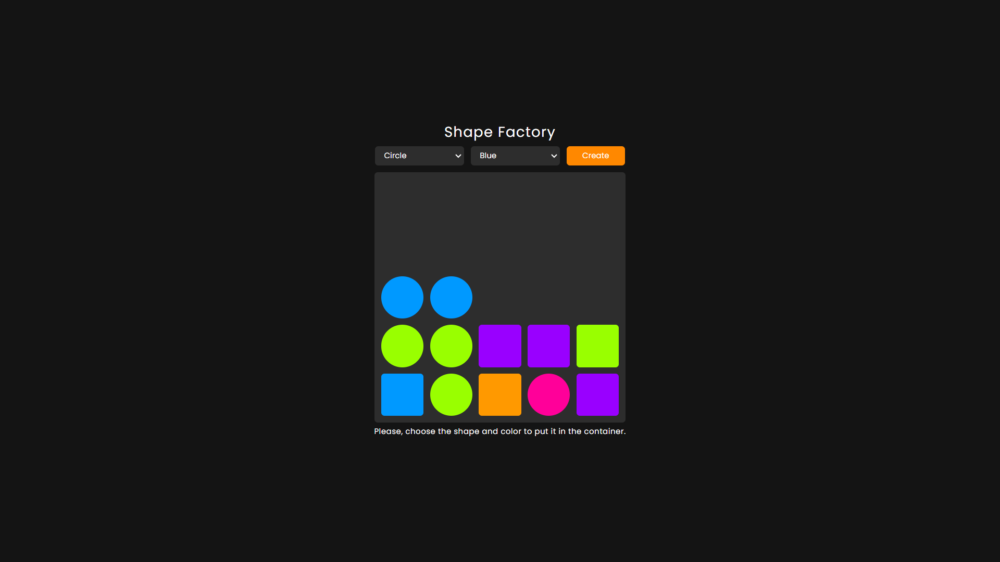

# Shape factory application

Welcome to the Shape Factory! This project is a creative and interactive 
application that allows users to generate different shapes and colors, 
providing a fun and educational experience.

Visit the website [here](https://douglasfssantiago.github.io/shape-factory/) 



## Features 

* Shape Selection: Choose from different shapes such as circles and squares to 
add variety to your creations.

* Color Customization: Select from a range of vibrant colors to personalize your 
shapes, including Blue, Green, Orange, Pink, and Purple.

* Interactive Shape Creation: Click the "Create" button to generate a shape with 
the selected attributes, which will be displayed in the container.

* Shape Information: Click on any shape in the container to see its detailed 
information, including its color and type.

* Capacity Management: The application can handle up to 25 shapes at a time. 
Once the container is full, further shape creation is disabled, ensuring 
efficient management of resources.

* User-Friendly Interface: The interface is designed to be intuitive and easy 
to use, with clear options and real-time feedback for a seamless user 
experience.
 
## Get Started

**To get started locally:**

Clone this repo:

```bash
git clone https://github.com/douglasfssantiago/shape-factory
cd shape-factory
```
Explore the different files.

Select the index.html file.

Do right-click and select the `Reveal in File Explorer` menu.

Double-click on file index.html.
<br/>